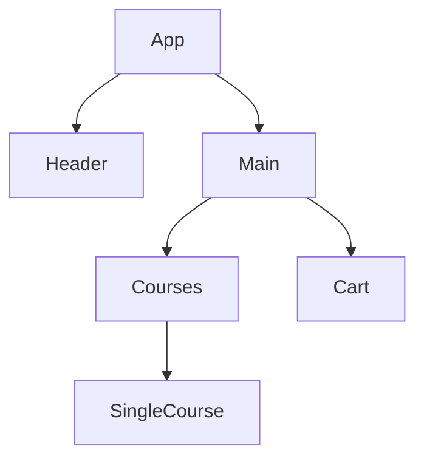

# Welcome to My Course Registration Project!

Hi, This is my course registration project. I want to discuss here some of the features implemented here

## Features

1.  Here Student can select their subject within the 20 credit limit.
2.  Selected Course will be shown in a list.
3.  Student can't select one course twice.
4.  [React Hot Toast](https://react-hot-toast.com/) is implemented to handle corner cases.

## How I managed the state

First I want show the components data flow chart for my projects.

Here In Main component I declare 4 state variable for courses, cart, remainingCreditHours and totalCreditHours.

- **courses** state is for storing courses data.
- **cart** state is for storing selected courses.
- **remainingCreditHours** state is for remaining credit hours after selecting a course.
- **totalCreditHours** state is for total credit hours for selected courses.

First I saved my courses data in to a file named data.json in public folder

### setCourses()

On loading the `Main` component it will set the **course** state by fetching all courses data from data.json file. It is done by _useEffect_ hook cause it helps to handle the side effects of a component.

### setCart()

In `SingleCourse` component there is select button to add the specific course in the cart. I pass a event handler from `Main` to `SingleCourse`. When a select button is clicked the event handler add the specific course to the **cart** state

### setRemainingCreditHours()

When select button is clicked the event handler set the the **remainingCreditHours** by subtracting the course creditHours from the **remainingCreditHours** state.

### setTotalCreditHours()

the event handler also calculate the total credit hours for selected course. And set it to the **totalCreditHours**.
